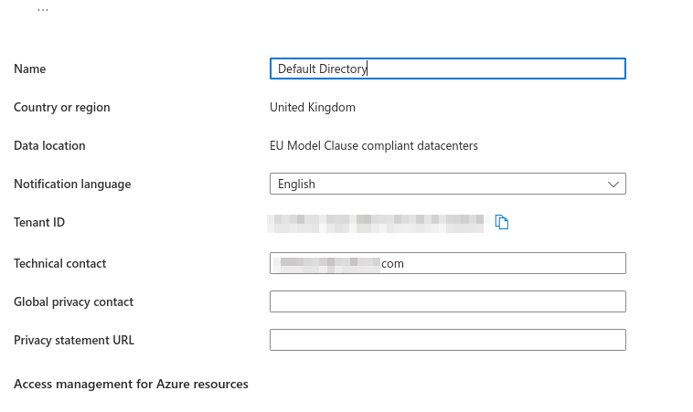
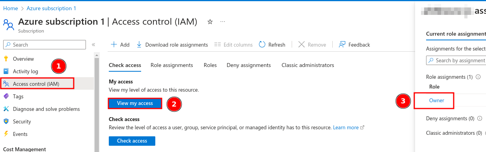

# Detailed Instructions
The detailed instructions for installing and uninstalling AHHHZURE are provided here.

## Installation TL/DR
What you need to do is:
1. Get on a Windows machine, check PowerShell version, install Az cli & Azure PowerShell module. 
2. Create a (free) Azure tenant.
3. Clone this repository, enter the directory & run `.\Install-Ahhhzure.ps1 -TenantId "my-tenant-id" -SubscriptionId "my-subscription-id" -All`
4. Follow the on screen instructions, grab a coffee, wait for 20 minutes and that's it! You should be able to get to hacking your own cloud now.

### Deployment Machine Requirements
- Windows Machine/VM with PowerShell version 5 or above - Although PowerShell has become platform agnostic, we recommend deploying using a Windows host. The labs themselves can be tackled on *nix systems. 
	- For Win 10 or later, the default "WIndows PowerShell" with blue background is v5.1. AHHHZURE also supports deployment using the newer PowerShell with black background, i.e. v7.
	- Run `$PSVersionTable.PSVersion` inside PowerShell to check if you want to be super sure.


- Az cli (**64-bit version**) for Windows, version >= 2.12.0. See [installing Az cli](https://learn.microsoft.com/en-us/cli/azure/install-azure-cli-windows).
	- It is recommended to use the MSI installer to install, for simplicity. Functionally it should be the same whichever way you choose to install it. On the *Install Azure CLI on Windows* page, go to *Microsoft Installer (MSI)* > *Latest MSI of the Azure CLI (64 bit)*. Download and run the installer.

- Azure (Az) PowerShell Module. See [installing Az PowerShell](https://learn.microsoft.com/en-us/powershell/azure/install-azure-powershell). Most of the steps below are copied from the linked Microsoft page:
	- First launch PowerShell as Administrator.
	- For Az PowerShell module, installing with the PS Gallery method is recommended, as I found digging through GitHub releases for a correct and latest MSI to potentially be slightly confusing. 
	- If you are on **PowerShell 5.1**, you'll also need to install [.NET 4.7.1+](https://learn.microsoft.com/en-us/dotnet/framework/install), and Install PowerShellGet: `Install-Module -Name PowerShellGet -Force`
	- (Uncommonly) If AzureRM is installed before, there are [special instructions](https://learn.microsoft.com/en-us/powershell/azure/troubleshooting?view=azps-11.5.0#az-and-azurerm-coexistence) to explain what to do. 
	- Set the PowerShell execution policy temporarily to remote-signed. `Set-ExecutionPolicy -ExecutionPolicy RemoteSigned -Scope CurrentUser`
	- Then install with `Install-Module -Name Az -Repository PSGallery -Force` and update with `Update-Module -Name Az -Force`.


#### Creating an Azure tenant
An Azure Tenant that you own & control is required to deploy AHHHZURE's vulnerable resources and users. Don't deploy AHHHZURE on a production tenant. Specifically, the deployment uses the permissions of a user who is:
- An account that owns the Tenant or has Global Admin / Owner role on the subscription.
- If you create a new Azure tenant, that should be the account you used in the process.
- The script assumes you did not attach any custom domain name to the to the directory. Hence, users and resources would be created under the default `yourdomain.onmicrosoft.com`.
	
The script checks that the Az CLI, PS module and appropriate permissions are in place and would exit automatically if they were not met.

It might be somewhat daunting to create a tenant if you've never worked with cloud deployments before. Most of the steps are intuitive but there are a few terminologies that can be confusing. Microsoft being Microsoft, requires some personal information for [creating a _free_ Azure acount](https://azure.microsoft.com/en-gb/free). Most importantly are an email address, a valid phone number and a credit/debit card. I usually use a fresh outlook email address to set it up to simplify the process. You do get a bunch of stuff for free though including $200 credits for first month and a [list of free services](https://azure.microsoft.com/en-us/free/#all-free-services). 

After creating the account, you now own a Tenant, a "Default Directory" and a Subscription called "Azure Subscription 1". To view info related to your tenant, login to [Azure Portal](https://portal.azure.com) with the credentials that were used to create the tenant. On the search bar of the portal home page, search for "tenant properties" and you should see it. After accessing "Tenat Properties" for the  first time, it would appears under Azure services and you can click on it instead. There you can find your **Tenant ID** needed for the script and you can rename the Directory if you like. 

Azure Portal home page:


Tenant properties page:



The **Subscription ID** can be found on the Subscription's page, likewise searchable or clickable from the Portal's home page. From the "Azure Subscription 1" page you may also rename the sub if you like. Before jumping off you may verify your **Owner** status on the Subscription by clicking *Access Control(IAM)* > *View my access* on the subscription page.




### Running the Script

When the requirements have all been sorted (good job by the way!), go ahead and clone the repo onto your local machine.

```
git clone https://github.com/gladstomych/AHHHZURE.git
cd AHHHZURE
```

#### Command Line Options
The script requires two mandatory flags: `-TenantId` and `-SubscriptionId`. These flags specify the tenant and subscription where resources will be deployed or removed.  To deploy all resources at once, use the `-All` flag. This process can take around 20 minutes due to the time required for cloud resources to initialize and configure. Sometimes PowerShell appears to be stuck for no reason and a couple of *Return* keystrokes should encourage it to keep going. 

You can also specify the region with an optional `-Region "<region>"` flag. If unspecified, the script defaults to `UK South`. See available Azure regions below.

```PowerShell
.\Install-Ahhhzure.ps1 -TenantId "my-tenant-id" -SubscriptionId "my-subscription-id" -All
```

You will then be prompted to log into your Azure tenant. Log in as the Tenant Owner / Global Admin and provide additional confirmations as required. Running the script without the `-All` or additional `-<Resouce>` flags would not deploy or remove any resources. The script would check if the requirements are met and then exit.

There may be on screen prompt during the script is run the first time to instal the `auth V2` extension of the `az webapp` module. This is normal and is required. If issues arise, the error messages are usually quite self explanatory. You may try to `-TearDown -All` and run the script again. If the issue persists, you may also try the 2-stepped method described below.


| Available Regions |         |         |         |         |        |
|---------|---------|-------- |-------- |---------|--------|
|Australia Central|Australia East|Australia Southeast|Brazil South|Canada Central|Canada East | 
|Central India| Central US |East Asia| East US |East US 2| France Central | 
|Germany West Central|Israel Central|Italy North |Japan East  |Japan West  |Korea Central|
|Korea South  |North Central US|North Europe|Norway East| Poland Central|Qatar Central|
|South Africa North| South Central US|South India |Southeast Asia|Sweden Central|Switzerland North|
|UAE North|  UK South| UK West| West Central US|West Europe |West India |


### (For debugging) Stepwise Deployment Sequence
You can also deploy resources individually using the following flags, for troubleshooting:

`-RG`, `-User`, `-VM`, `-Storage`, `-KeyVault`, `-WebApp`

Due to interdependencies between resources, it is advised to deploy them in a specific sequence. Note that the order of passing the resource flags to a single run do not affect how the script is executed. The script deploys with a hardcoded order, and would simply skip resources not flagged for deployment. When problems arise, try to deploy in 2 steps like this, after tearing down everything first:

```
.\Install-Ahhhzure.ps1 -TenantId "my-tenant-id" -SubscriptionId "my-subscription-id" -TearDown -All
.\Install-Ahhhzure.ps1 -TenantId "my-tenant-id" -SubscriptionId "my-subscription-id" -RG -User -VM
.\Install-Ahhhzure.ps1 -TenantId "my-tenant-id" -SubscriptionId "my-subscription-id" -Storage -KeyVault -WebApp
```

### (For debugging) Resouce Dependencies
The resources would not be deployed correctly if certain elements are not deployed already.

- RG: No dependencies.
- User: No dependencies.
- VM: Requires RG, User.
- Storage: Requires RG, User.
- KeyVault: Requires RG, User, Storage (should be run together with Storage).
- WebApp: Requires RG, User, KeyVault


### Uninstalling
To remove any resource, use the `-TearDown` flag. Removing all resources deployed by AHHHZURE is done by passing the `-TearDown` flag with `-All`, which typically takes around 5 minutes.

```PowerShell 
.\Install-Ahhhzure.ps1 -TenantId "my-tenant-id" -SubscriptionId "my-subscription-id" -TearDown -All
```

**Note**: Like deployment, not specifying any resource flag or `-All` will result in no change being made to your tenant. While it is possible to remove individual resources, the `-All` flag is recommended.
